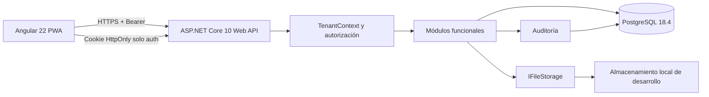
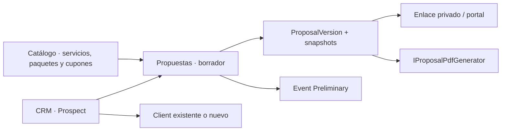
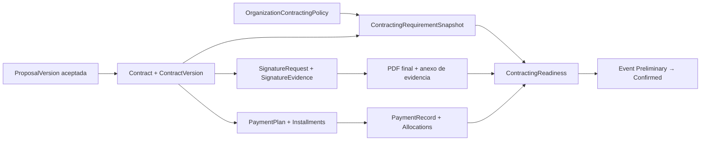
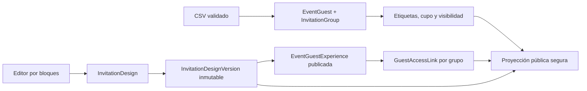
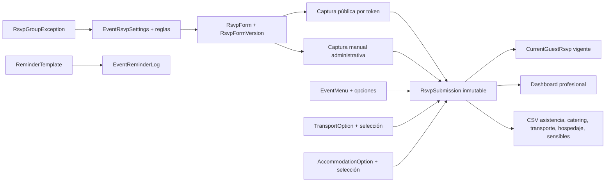

# Arquitectura

## Resumen

Plannyt usa un monolito modular desplegable como una sola Web API ASP.NET Core y
una sola aplicación Angular. PostgreSQL es la fuente transaccional. Los archivos
de desarrollo se guardan fuera de la carpeta pública mediante una abstracción
reemplazable.



## Componentes

### Frontend

- Angular 22 con TypeScript estricto.
- Componentes standalone, lazy loading y formularios reactivos.
- Signals, servicios y estado local; no se introduce NgRx sin necesidad
  demostrada.
- El access token vive únicamente en memoria.
- El service worker no guarda tokens ni respuestas privadas de la API.
- Áreas separadas para autenticación, operación profesional y portal.

### API

- .NET SDK `10.0.302`, `net10.0` y ASP.NET Core 10.
- Una Web API organizada por módulos funcionales.
- DTO y validación por operación.
- Manejo global de errores mediante Problem Details.
- Logging estructurado con correlación y redacción de secretos.
- OpenAPI solo en desarrollo, health checks y rate limiting.
- I/O asíncrono y nullable reference types.

### Persistencia

- EF Core 10 con Npgsql compatible.
- Un `DbContext`, esquema `public` y una secuencia de migraciones.
- UUID generados en la aplicación.
- `timestamptz` para instantes UTC y cadenas IANA para zonas horarias.
- Restricciones y claves compuestas como segunda barrera multi-tenant.

### Archivos

- `IFileStorage` separa metadatos de contenido.
- Implementación local solo en Development.
- Rutas internas generadas, nunca nombres proporcionados por el usuario.
- Descarga exclusivamente mediante endpoints autorizados.

## Flujo de una solicitud profesional

1. La autenticación valida firma, emisor, audiencia y vigencia del JWT.
2. El validador de sesión comprueba `sid`, cuenta activa, sesión activa y
   `SecurityVersion`.
3. La ruta proporciona `organizationId` como selector.
4. `TenantContext` verifica una membresía activa y resuelve permisos efectivos.
5. El módulo recibe el tenant validado y no acepta `OrganizationId` del body.
6. La consulta incluye la organización y proyecta un DTO.
7. Las mutaciones sensibles producen `AuditEntry`.

## Flujo del portal

1. La sesión global se valida.
2. La ruta identifica el evento, no una organización elegida por el navegador.
3. El backend encuentra un `EventAccess` activo, vigente y no revocado.
4. La organización se obtiene desde ese acceso y desde el evento.
5. Se proyectan únicamente campos compartidos, participantes visibles y
   documentos `ClientShared`.

## Autenticación y sesiones

- Contraseñas mediante `IPasswordHasher<UserAccount>` de ASP.NET Core Identity.
- Access token de 10 minutos con `sub`, `sid`, `security_version`, emisor y
  audiencia.
- Refresh token aleatorio de alta entropía con vigencia máxima de 30 días.
- El refresh token se guarda mediante hash y rota en cada uso.
- La reutilización de un token rotado revoca la cadena completa.
- Logout revoca la sesión actual y `logout-all` revoca todas las sesiones.
- No se guardan permisos efectivos completos en el JWT.

## Autorización

Todo está denegado por defecto. Los roles aportan permisos iniciales; los grants
pueden agregar o denegar permisos con alcance y vencimiento. Un `Deny` explícito
aplicable prevalece. La autorización comprueba además estado, fechas, tenant y
límites de delegación.

## Multi-tenancy

La organización se envía en rutas profesionales como selector explícito. Nunca se
considera una autorización. Las escrituras reciben el `OrganizationId` desde
`TenantContext`.

La defensa tiene tres niveles:

1. Resolución central del tenant y permisos.
2. Consultas y comandos acotados por organización.
3. Foreign keys y restricciones compuestas que rechazan relaciones cruzadas.

Los query filters de EF Core son una defensa complementaria, no la única.

## Fallos previstos

| Fallo | Comportamiento |
|---|---|
| PostgreSQL no disponible | Readiness no saludable; no se aceptan operaciones |
| Sesión revocada | La siguiente solicitud autenticada devuelve 401 |
| Membresía o acceso revocado | La operación devuelve 403 o 404 sin filtrar datos |
| Reutilización de refresh token | Se revoca la cadena de sesiones y se audita |
| Almacenamiento local no disponible | No se guarda metadata huérfana; se informa error |
| Archivo inválido | Se rechaza antes de quedar disponible |
| Invitación vencida o usada | No se crea acceso ni membresía |

## Estructura prevista

```text
plannyt/
├── apps/
│   ├── api/
│   │   ├── Plannyt.Api.slnx
│   │   ├── src/Plannyt.Api/
│   │   │   ├── BuildingBlocks/
│   │   │   ├── Infrastructure/
│   │   │   └── Modules/
│   │   └── tests/
│   └── web/
│       ├── src/
│       └── e2e/
├── docs/decisions/
├── docker-compose.yml
├── global.json
├── .nvmrc
└── README.md
```

No se crean ensamblados o carpetas para módulos futuros.

## Integraciones futuras

Correo, Cloudinary, WhatsApp, mapas, redes sociales, IA y cobros quedan fuera. Sus
futuras implementaciones deberán conectarse mediante contratos explícitos sin
alterar el núcleo del evento ni la autorización multi-tenant.

## Extensión comercial del Sprint 1A

CRM, catálogo y propuestas se incorporan como módulos del mismo monolito. El
flujo conserva la dirección de dependencias:



- `ProposalDraftLine` es mutable; `ProposalVersion` y `ProposalLine` son
  inmutables por diseño.
- `ProposalTotalsCalculator` recalcula líneas, descuentos compartidos, cupones,
  impuestos y redondeos en el servidor.
- `IProposalPdfGenerator` genera un PDF interno desde el DTO de una versión; no
  usa servicios externos.
- La vista pública usa token con hash, vencimiento, revocación, rate limiting y
  un DTO sin notas internas.
- El portal autenticado reutiliza la proyección pública, nunca la administrativa.
- Aceptar no confirma el evento: contrato, firma y pagos siguen fuera del
  sistema hasta el Sprint 1B.

## Extensión de contratación del Sprint 1B

El monolito incorpora `Contracts` y `Payments` como módulos separados de
`Proposals` y `Events`. La versión aceptada es una entrada inmutable del
contrato, no el contrato mismo.



- El renderizador usa un catálogo central de variables y HTML sanitizado.
- Al publicar se genera el PDF original, se calcula SHA-256 sobre sus bytes y
  la versión queda bloqueada por dominio y por `SaveChanges`.
- La firma propia es electrónica simple. Se conserva consentimiento, persona
  declarada, método, fecha, sesión o token, IP limitada, agente de usuario,
  correlación y hash.
- `IFileStorage` conserva por separado PDF publicado, imagen dibujada opcional,
  comprobantes y PDF final con el anexo de evidencia.
- El portal obtiene contratos, pagos y readiness mediante proyecciones propias
  sujetas a acceso activo al evento; no reutiliza DTO administrativos.
- Solo `ContractingReadinessService` decide si el evento puede confirmarse.

## Extensión de invitados y experiencia digital del Sprint 2A

`Guests` e `Invitations` son módulos separados dentro del monolito. El primero
administra el padrón del evento; el segundo publica una versión compartida y
resuelve una proyección distinta para cada grupo.



- El editor acepta únicamente temas, bloques, propiedades y variables de un
  catálogo cerrado; no almacena HTML, CSS o scripts arbitrarios.
- Editar después de aprobar invalida la aprobación. Publicar apunta a una
  versión exacta e inmutable.
- El acceso público busca por SHA-256. El valor del token se deriva mediante
  HMAC-SHA-384 del identificador aleatorio del enlace y una clave exclusiva, por
  lo que puede reconstruirse para un usuario autorizado sin persistirlo.
- El portal usa DTO y rutas propios. No expone notas, correo, teléfono,
  organización ni operaciones de publicación, regeneración o revocación.
- La PWA no guarda respuestas `/api/**`; la ruta `/i/:token` usa `no-store`,
  `no-referrer`, `noindex` y respeta movimiento reducido.

## Extensión RSVP del Sprint 2B

`Rsvp` se incorpora como módulo separado dentro del monolito. Administra la
confirmación de asistencia, menús, transporte, hospedaje, datos sensibles y
recordatorios, con formulario versionado y entregas inmutables.



- La configuración RSVP pertenece al evento y controla apertura, cierre,
  cambios posteriores y mensajes mediante una máquina de estados propia.
- El formulario versionado sigue el mismo patrón que propuestas y diseños de
  invitación: borrador mutable, revisión, aprobación y versión publicada
  inmutable.
- Las entregas son append-only con llave de cliente, `RequestFingerprint`,
  `RevisionNumber` y `PreviousSubmissionId`; `SaveChanges` rechaza cualquier
  modificación o eliminación.
- `CurrentGuestRsvp` es una proyección por invitado o slot de acompañante. Se
  actualiza en la transacción de entrega o mediante el reconciliador
  administrativo auditado.
- Las exportaciones CSV usan `RsvpExportService` con neutralización de formula
  injection y permisos separados por tipo de dato.
- El acceso público deriva el token con `GuestAccessTokenService` usando llave
  versionada; la validación histórica permite rotación sin invalidar enlaces
  existentes.
- La captura pública usa un DTO propio que omite datos sensibles. La lectura
  profesional sensible está separada y exige permiso explícito.
- Los recordatorios no integran un servicio externo de envío; el módulo solo
  gestiona plantillas y registros de marca manual.
