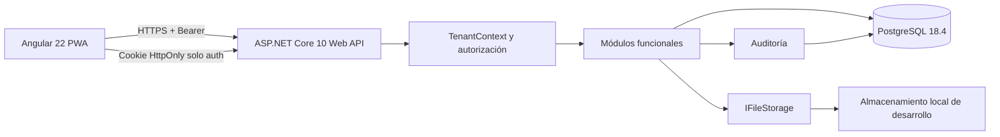

# Arquitectura

## Resumen

Plannyt usa un monolito modular desplegable como una sola Web API ASP.NET Core y
una sola aplicación Angular. PostgreSQL es la fuente transaccional. Los archivos
de desarrollo se guardan fuera de la carpeta pública mediante una abstracción
reemplazable.



## Componentes

### Frontend

- Angular 22 con TypeScript estricto.
- Componentes standalone, lazy loading y formularios reactivos.
- Signals, servicios y estado local; no se introduce NgRx sin necesidad
  demostrada.
- El access token vive únicamente en memoria.
- El service worker no guarda tokens ni respuestas privadas de la API.
- Áreas separadas para autenticación, operación profesional y portal.

### API

- .NET SDK `10.0.302`, `net10.0` y ASP.NET Core 10.
- Una Web API organizada por módulos funcionales.
- DTO y validación por operación.
- Manejo global de errores mediante Problem Details.
- Logging estructurado con correlación y redacción de secretos.
- OpenAPI solo en desarrollo, health checks y rate limiting.
- I/O asíncrono y nullable reference types.

### Persistencia

- EF Core 10 con Npgsql compatible.
- Un `DbContext`, esquema `public` y una secuencia de migraciones.
- UUID generados en la aplicación.
- `timestamptz` para instantes UTC y cadenas IANA para zonas horarias.
- Restricciones y claves compuestas como segunda barrera multi-tenant.

### Archivos

- `IFileStorage` separa metadatos de contenido.
- Implementación local solo en Development.
- Rutas internas generadas, nunca nombres proporcionados por el usuario.
- Descarga exclusivamente mediante endpoints autorizados.

## Flujo de una solicitud profesional

1. La autenticación valida firma, emisor, audiencia y vigencia del JWT.
2. El validador de sesión comprueba `sid`, cuenta activa, sesión activa y
   `SecurityVersion`.
3. La ruta proporciona `organizationId` como selector.
4. `TenantContext` verifica una membresía activa y resuelve permisos efectivos.
5. El módulo recibe el tenant validado y no acepta `OrganizationId` del body.
6. La consulta incluye la organización y proyecta un DTO.
7. Las mutaciones sensibles producen `AuditEntry`.

## Flujo del portal

1. La sesión global se valida.
2. La ruta identifica el evento, no una organización elegida por el navegador.
3. El backend encuentra un `EventAccess` activo, vigente y no revocado.
4. La organización se obtiene desde ese acceso y desde el evento.
5. Se proyectan únicamente campos compartidos, participantes visibles y
   documentos `ClientShared`.

## Autenticación y sesiones

- Contraseñas mediante `IPasswordHasher<UserAccount>` de ASP.NET Core Identity.
- Access token de 10 minutos con `sub`, `sid`, `security_version`, emisor y
  audiencia.
- Refresh token aleatorio de alta entropía con vigencia máxima de 30 días.
- El refresh token se guarda mediante hash y rota en cada uso.
- La reutilización de un token rotado revoca la cadena completa.
- Logout revoca la sesión actual y `logout-all` revoca todas las sesiones.
- No se guardan permisos efectivos completos en el JWT.

## Autorización

Todo está denegado por defecto. Los roles aportan permisos iniciales; los grants
pueden agregar o denegar permisos con alcance y vencimiento. Un `Deny` explícito
aplicable prevalece. La autorización comprueba además estado, fechas, tenant y
límites de delegación.

## Multi-tenancy

La organización se envía en rutas profesionales como selector explícito. Nunca se
considera una autorización. Las escrituras reciben el `OrganizationId` desde
`TenantContext`.

La defensa tiene tres niveles:

1. Resolución central del tenant y permisos.
2. Consultas y comandos acotados por organización.
3. Foreign keys y restricciones compuestas que rechazan relaciones cruzadas.

Los query filters de EF Core son una defensa complementaria, no la única.

## Fallos previstos

| Fallo | Comportamiento |
|---|---|
| PostgreSQL no disponible | Readiness no saludable; no se aceptan operaciones |
| Sesión revocada | La siguiente solicitud autenticada devuelve 401 |
| Membresía o acceso revocado | La operación devuelve 403 o 404 sin filtrar datos |
| Reutilización de refresh token | Se revoca la cadena de sesiones y se audita |
| Almacenamiento local no disponible | No se guarda metadata huérfana; se informa error |
| Archivo inválido | Se rechaza antes de quedar disponible |
| Invitación vencida o usada | No se crea acceso ni membresía |

## Estructura prevista

```text
plannyt/
├── apps/
│   ├── api/
│   │   ├── Plannyt.Api.slnx
│   │   ├── src/Plannyt.Api/
│   │   │   ├── BuildingBlocks/
│   │   │   ├── Infrastructure/
│   │   │   └── Modules/
│   │   └── tests/
│   └── web/
│       ├── src/
│       └── e2e/
├── docs/decisions/
├── docker-compose.yml
├── global.json
├── .nvmrc
└── README.md
```

No se crean ensamblados o carpetas para módulos futuros.

## Integraciones futuras

Correo, Cloudinary, WhatsApp, mapas, redes sociales, IA y cobros quedan fuera. Sus
futuras implementaciones deberán conectarse mediante contratos explícitos sin
alterar el núcleo del evento ni la autorización multi-tenant.
