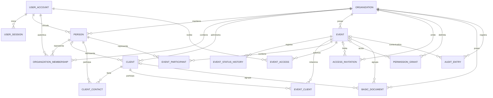
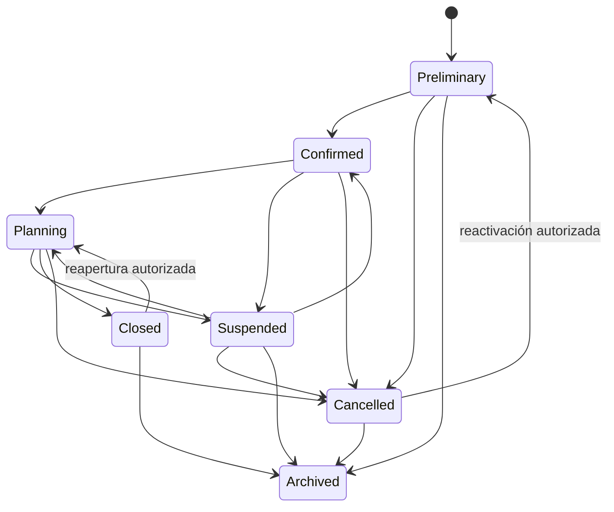

# Modelo de dominio inicial

## Diagrama

## Identidad y organización

### UserAccount

Identidad autenticable global. `Email` es la única fuente de verdad para login.
Incluye correo normalizado, hash de contraseña, verificación, estado,
`SecurityVersion`, último acceso y fechas de creación y actualización.

### UserSession

Representa una cadena de renovación. Guarda solamente el hash del refresh token,
vigencia, uso, revocación, sesión reemplazante, IP, agente de usuario,
persistencia y versión de seguridad al crearla.

### Organization

Tenant independiente. Contiene nombre, slug, tipo, zona horaria, país, moneda,
estado y fechas.

### Person

Perfil privado dentro de una organización. Puede vincularse con una cuenta global,
pero también existir sin cuenta. Dos organizaciones pueden representar a la misma
persona real con registros independientes.

No se deduplica por correo o teléfono. Solo puede existir un perfil activo por
`OrganizationId` y `LinkedUserAccountId`.

### OrganizationMembership

Relaciona organización, cuenta y perfil de persona. Contiene rol base, estado,
fecha de ingreso, vencimiento y fechas de auditoría.

## CRM

### Client

Registro privado del CRM. Puede ser:

- `Person`: requiere `PersonId` de la misma organización y no utiliza
  `CompanyName`.
- `Company`: requiere `CompanyName` y no utiliza `PersonId`.

Incluye nombre visible, estado, fuente y borrado lógico.

### ClientContact

Relaciona un cliente con una persona de la misma organización, incluyendo rol de
contacto e indicador principal.

## Eventos

### Event

Campos compartibles:

- `Id`, `Name`, `EventType`.
- `StartDateTime`, `EndDateTime`, `TimeZone`.
- `City`, `CountryCode`, `SharedDescription`.
- `EstimatedGuestCount`.

Campos administrativos:

- `OrganizationId`, `Status`, `StatusBeforeSuspension`.
- `CreatedBy`, `CreatedAt`, `UpdatedAt`, `ArchivedAt`.

### EventStatusHistory

Registra estado anterior, estado nuevo, motivo, actor y fecha. Toda transición
ocurre mediante un servicio de dominio.

### EventClient

Relaciona clientes y eventos del mismo tenant. Incluye tipo de relación,
principalidad y autoridad de transferencia.

### EventParticipant

Relaciona una persona y un evento del mismo tenant. Incluye tipo, orden,
visibilidad para cliente y descripción compartida.

## Acceso

### EventAccess

Relaciona cuenta global con un evento. Contiene rol base, estado, inicio,
expiración, invitador, aceptación y revocación. No convierte al cliente en miembro
interno de la organización.

### AccessInvitation

Una entidad soporta dos tipos:

- `OrganizationMembership`: crea una membresía interna.
- `EventAccess`: crea acceso al evento.

Contiene roles previstos separados, correo objetivo normalizado, hash de token,
vigencia, aceptación, revocación, invitador y fechas. El token original se entrega
una sola vez.

### PermissionGrant

Concede o deniega un permiso central a una cuenta o membresía dentro de una
organización. Puede limitarse a un evento y tener vencimiento. Debe cumplirse:

- exactamente un sujeto;
- `EventId` obligatorio cuando el alcance es de evento;
- todas las referencias tenant-aware pertenecen a la misma organización.

## Documentos y auditoría

### BasicDocument

Metadatos de un archivo interno o compartido. Guarda nombre original para
presentación y una clave interna segura para almacenamiento. Puede asociarse con
evento y cliente del mismo tenant. El contenido no se almacena en PostgreSQL.

### AuditEntry

Registra actor, acción, entidad, identificador, metadata segura, instante,
correlación e IP cuando corresponda. No contiene secretos ni el cuerpo completo
de archivos o solicitudes.

## Estados del evento

`Archived` no admite cambios normales. Una restauración futura requerirá permiso
especial y auditoría. `ArchivedAt` solo contiene valor cuando el estado es
`Archived`.
